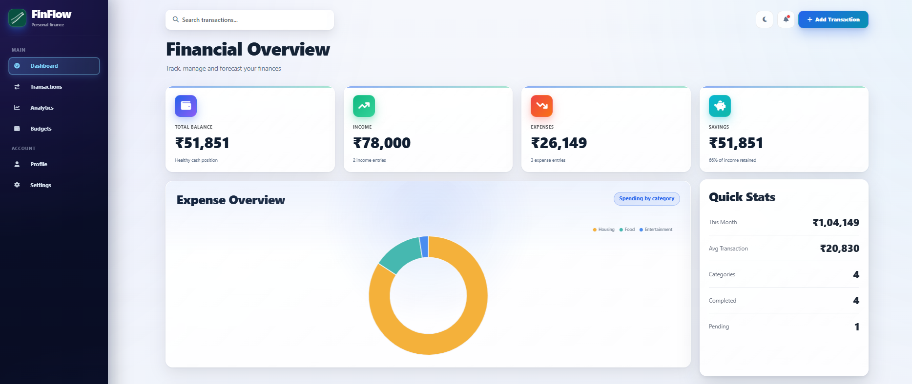
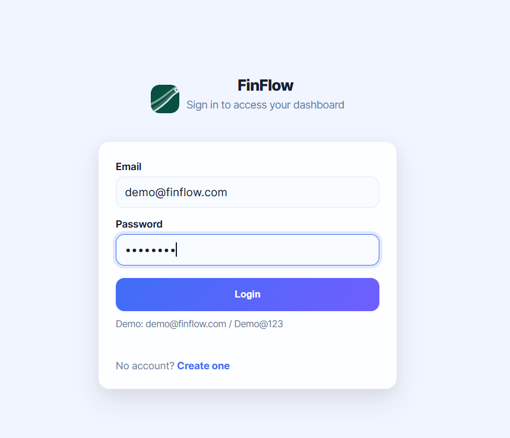
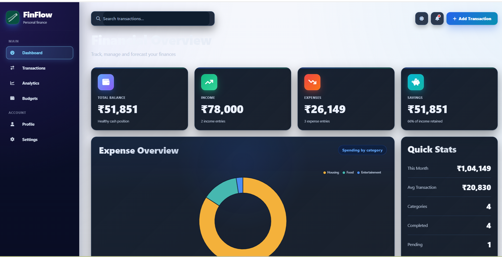
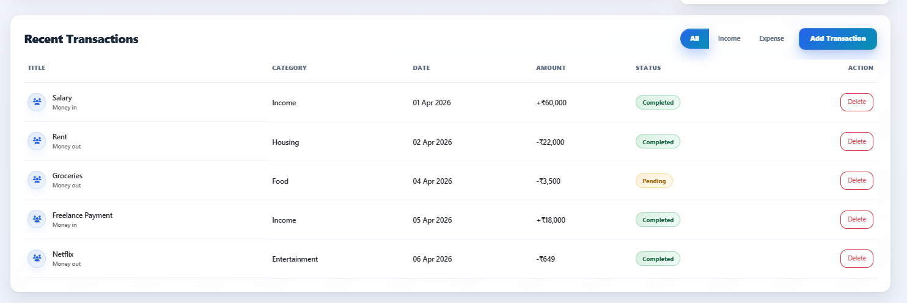

# FinFlow - Finance Dashboard

A modern finance dashboard for tracking income, expenses, savings, and transaction history with authentication and dark mode support.

## Live Demo

https://finflow-ui.netlify.app/

## Overview

FinFlow is a frontend-based personal finance dashboard designed to make money tracking simple and visual.

Key capabilities:
- Track income and expense transactions
- View balance, savings, and quick monthly stats
- Analyze spending by category with a chart
- Manage your data per user using browser storage

## Features

- Login and signup flow with localStorage-based auth
- Multi-user transaction storage
- Dashboard summary cards (Balance, Income, Expenses, Savings)
- Category expense chart (Chart.js)
- Add and delete transactions
- Filter transactions by type
- Search transactions by title
- Dark mode with persisted theme preference
- Responsive layout for desktop and mobile

## Screenshots

### Dashboard


### Login


### Dark Mode


### History


## Tech Stack

- HTML5
- CSS3
- JavaScript (Vanilla JS)
- Bootstrap 5
- Chart.js

## Project Structure

```text
finance-dashboard/
|-- index.html
|-- login.html
|-- signup.html
|-- style.css
|-- script.js
|-- auth.js
|-- README.md
`-- screenshots/
```

## Getting Started

1. Clone the repository:

```bash
git clone https://github.com/saniya196/FinFlow-Finance-Dashboard-System.git
cd FinFlow-Finance-Dashboard-System
```

2. Open `login.html` in your browser.

You can also open `index.html`, but unauthenticated users are redirected to the login page.

## Demo Credentials

- Email: demo@finflow.com
- Password: Demo@123

## Data Storage

FinFlow stores data in browser localStorage with these keys:

- `ff_users`: registered users
- `ff_current_user`: current logged-in user email
- `ff_transactions_<email>`: transactions per user
- `fintrack-theme`: selected theme

## Notes

- This is a frontend-only project.
- Data is stored locally in the browser and is not synced to a backend.

## Future Improvements

- Backend integration (Node.js or Firebase)
- Secure password hashing and token-based sessions
- Cloud database support
- Advanced analytics and reports export (PDF/CSV)

## Author

Saniya Asreen

GitHub: https://github.com/saniya196